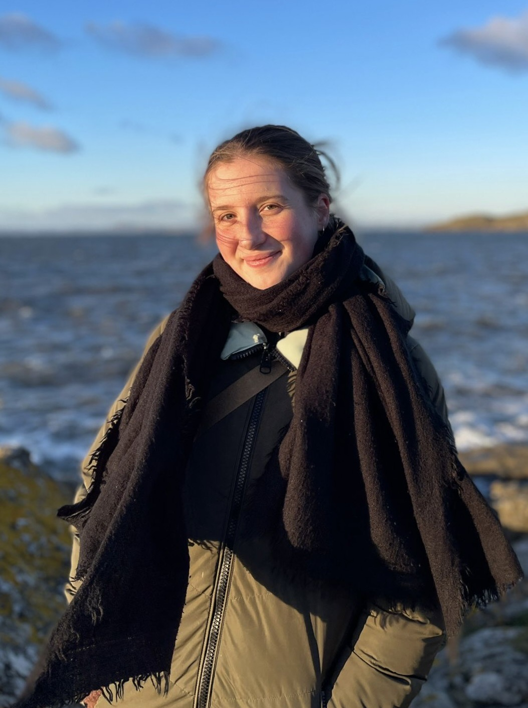
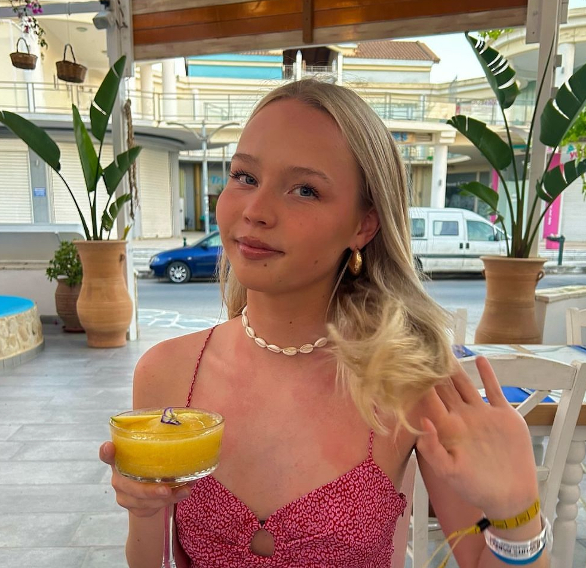

--- 
title: "How to find research experience"
author: "Psychology Community and Research Association (PsyCRA)"
date: "`r Sys.Date()`"
site: bookdown::bookdown_site

---


# Welcome!

Are you interested and motivated to find research opportunities alongside your psychology degree? Not sure what's out there or how to make sense of it? We've been there too and made this guide for you :)

This is a list of opportunities based on PsyCRA enthuisiasts' research experience during their psychology degrees. We hope that this will be helpful and provide a starting point from which you can find opportunities that are right for you.

## A message of encouragement

Research experience will be easier to get as you move up years and be most easily available in 4th year and beyond. No one expects to have done much prior to that, but you definitely can if that interests you! The list below can help you be proactive when your emails go unanswered and you want to strengthen your skills.

## Disclaimer

This list is not exhaustive. If you know of anything that should go on the list, please let us know!

## About PsyCRA

The Psychology Community and Research Association was founded in 2021 as a subcomittee of the Edinburgh University Psychology Society. It is a society where you can:

 - learn how to get research experience
 
 - get advice on postgraduate applications
 
 - learn about honours courses and dissertations
 
 - vent with no judgement (because we all get overwhelmed sometimes...)
 
You can follow us on instagram at [@psycra.ed](https://www.instagram.com/psycra.ed/https://www.instagram.com/psycra.ed/).


## People

**Current committee (2024/2025)**
<br>

```{r echo=FALSE, out.width = '350px', fig.align='center'}

```

<center>
**Jana Tomastikova**
<br>
Head of PsyCRA (made this doc - hello!)
<br>
Email me if you see mistakes, have questions or any comments (s2158655@ed.ac.uk)
</center>
<br>

```{r echo=FALSE, out.width = '350px', fig.align='center'}

```

<center>
**Millie Davies**
<br>
Events Coordinator
</center>
<br>

```{r echo=FALSE, out.width = '350px', fig.align='center'}

```

<center>
**Jennifer Islam**
<br>
Communications Officer
</center>
<br>

```{r echo=FALSE, out.width = '350px', fig.align='center'}
knitr::include_graphics('./assets/chris.png')
```

<center>
**Christopher Stordahl**
<br>
Postgraduate Liason
</center>
<br>

**Past committee members**

 - Sinéad Cleary (Head of PsyCRA 2023/2024, Communications Officer 2022/2023)
 - Mine Gelegen (Communications Officer 2023/2024)
 - Clara Sanchez-Izquierdo Lozano (Head of PsyCRA 2022/2023)
 - Kate Li (Events Coordinator 2022/2023)
 - Naiti Bhatt (Postgraduate Liason 2022/2023)

**Founders - the OGs - the CEOs (thanks guys)**

  - Julie Pedersen (Head of PsyCRA 2021/2022, Postgraduate Liason 2023/2024)
  - Charlotte Sudduth (Events Coordinator 2021/2022)
  - Kayleigh Smith (Communications Officer 2021/2022)
  
<br>
  
```{r echo=FALSE, out.width = '300px', fig.align='center'}
knitr::include_graphics('./assets/psycra_logo.png')
```


